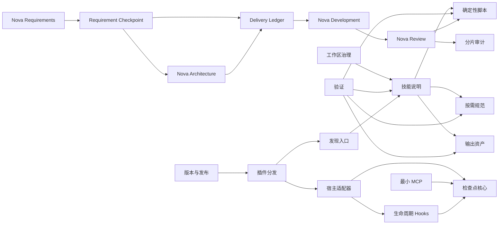

# AI Skills 工作区 — 项目蓝图

> 蓝图规范版本：3
> 文档定位：定义所有技能共同遵守的工作区事实、代码落位、模块契约、系统资源边界和未完成工作包。
> 事实来源：总体业务以 `.nova/PRODUCT_REQUIREMENTS.md` 与需求块为准，待开发目标以 `.nova/design/` 工作包为准；当前行为以技能源码、脚本和测试为准。
> 源码边界：`/home/nika/workspace/ai/nova-forge` 是唯一可写源码；插件包由此生成，个人技能目录只保留兼容发现链接。

## 1. 项目定位

| 对象 | 问题 | 成功结果 |
|------|------|----------|
| 技能使用者 | 需要可发现且不越权的专业工作流 | 调用技能得到符合声明契约的结果 |
| 技能维护者 | 开发目录和个人安装目录容易形成多个可写副本 | 工作区保留唯一源码，修改可验证、可审查、可恢复 |
| Codex 运行时 | 长说明和重复事实会污染上下文 | 入口保持紧凑，条件性规范按需加载，结果不泄漏内部推理 |

## 2. 技术栈

| 类别 | 当前事实或硬约束 | 事实来源 |
|------|------------------|----------|
| 技能说明 | Markdown 与 YAML frontmatter | 各技能 `SKILL.md` |
| UI 元数据 | YAML | 各技能 `agents/openai.yaml` |
| 规范、模板与示例 | Markdown | 各技能 `references/` 与 `assets/` |
| 确定性校验与治理关闭 | Python 3 标准库；Ubuntu、macOS、Windows 原生运行，公共命令与审计语义跨平台一致 | 各技能 `scripts/` 与三平台治理测试 |
| 插件运行时 | Node.js 22.5+、ESM、仅标准库；缺失时明确失败，不自动安装 Node.js 或 Bun | [双宿主插件工程骨架](architecture/foundation/dual-host-plugin.md) |
| 插件封装 | Codex `.codex-plugin/plugin.json`、Claude Code `.claude-plugin/plugin.json`、共享 `skills/` 与 `hooks/` | 双宿主官方插件规范与工程骨架契约 |
| 会话连续性 | stdio MCP 提交结构化权威状态，Hook 校验、阻断并在 `SessionStart` 注入恢复胶囊 | [会话检查点数据契约](architecture/data/session-checkpoint.md) |
| 审计记录 | JSONL 与严格 JSON-in-YAML | `.nova/audit/features/`、`.nova/audit/reviews/` 与 `.nova/audit/index/` |
| 发现入口 | 支持且已启用插件的宿主只使用版本化插件；Codex IDE、旧版宿主和显式故障恢复互斥使用安全软链接 | 双 manifest、双 marketplace、兼容安装检查、入口优先级及两个宿主的用户级规则链接状态 |
| 发布 | SemVer；`package.json` 为版本单一来源；主分支只跑 CI，人工 `vX.Y.Z` 标签触发 GitHub Release | manifests、marketplaces 与 GitHub Actions |
| 版本控制 | 本地 Git 仓库；远程配置、push 和其他外部写操作需独立授权 | `.git/`、仓库配置与 C-07 |

## 3. 代码结构

### 顶层目录

```text
.nova/
├── PRODUCT_REQUIREMENTS.md          总体业务、需求索引与状态契约（按需）
├── PROJECT_BLUEPRINT.md             工作区公共技术契约和待办索引
├── requirements/                    可独立交付的长期需求块（按需）
├── delivery/                        每个需求版本的任务与内部里程碑台账（按需）
├── architecture/                    并行开发前置共享契约（按需）
├── design/                          已确认或已实现的功能设计
└── audit/                           分片 Review 与完成审计
.codex-plugin/plugin.json            Codex 插件 manifest
.claude-plugin/plugin.json           Claude Code 插件 manifest
.claude-plugin/marketplace.json      Claude Code GitHub marketplace
.agents/plugins/marketplace.json     Codex GitHub marketplace
.github/workflows/                   三平台 CI 与人工标签发布
package.json                         插件 SemVer 单一来源
codex/
├── AGENTS.global.md                 双宿主静态治理规则权威载荷及兼容安装源
└── scripts/                         双宿主兼容安装、验证及规则契约测试
skills/                              五个 Nova 技能的唯一权威源码
└── nova-*/
    ├── SKILL.md                     技能入口和资源路由
    ├── agents/openai.yaml           可选 UI 元数据
    ├── references/                  按需规范与完整示例
    ├── assets/                      生成结果使用的模板和静态资源
    └── scripts/                     确定性工具及其测试
hooks/                               双宿主生命周期声明与启动命令
runtime/
├── adapters/                        Codex 与 Claude Code 薄适配器
├── core/                            检查点、恢复胶囊、代际和 TTL
└── mcp/                             最小结构化写入与查询工具
compat/                              软链接安装、检查与回滚
```

### 代码落位规则

| 代码区域 | 职责 | 代码落位规则 |
|----------|------|--------------|
| `.nova/` | 项目治理文档 | 总体需求、技术蓝图、按需架构契约、功能设计和审计统一落位；不创建空占位目录 |
| `.nova/requirements/` | 长期需求块 | 一个文件保存一个可由全栈工程师独立交付的完整业务定义 |
| `.nova/delivery/` | 需求版本交付台账 | 一个严格 JSON 文件保存一个 `REQ@版本` 的独立工作项、内部里程碑、依赖、计划变化和聚合状态；蓝图仅作未完成任务投影 |
| `.nova/architecture/` | 并行开发前置 | 只保存共享 API、数据、事件与 Mock 契约，不保存实现代码或 ADR |
| `.nova/design/` | 工作区功能设计 | 一个史诗可含多个相关工作包，已完成设计继续保留 |
| `.nova/audit/` | Review 与完成功能审计 | 年度功能 JSONL、月度严格 JSON-in-YAML、工作项哈希索引，不建立无限增长总账 |
| `codex/` | Codex 与 Claude Code 共用的全局治理及兼容安装工具 | 权威规则只保留一份；使用非 `AGENTS.md` 文件名避免项目范围重复加载；安装脚本只维护安全符号链接 |
| `skills/nova-*/SKILL.md` | 触发、核心规则和资源路由 | 五个技能只在标准 `skills/` 保留一份权威源码，目标少于 500 行 |
| `skills/nova-*/references/` | 条件性流程、格式规范和完整示例 | 由 `SKILL.md` 说明读取条件，规则只保留一份 |
| `skills/nova-*/assets/` | 复制或改写为输出的模板 | 不作为隐藏指令或运行状态存储 |
| `skills/nova-*/scripts/` | 可重复的确定性操作 | 同目录放直接测试，失败返回非零状态 |
| `.codex-plugin/`、`.claude-plugin/`、`.agents/plugins/` | 插件身份、组件和 marketplace 入口 | 路径指向插件根共享组件，版本由 `package.json` 同步，不复制技能或规则正文 |
| `hooks/`、`runtime/adapters/` | 解析宿主事件并映射为共享操作 | 只处理宿主字段、阻断语义和上下文输出，不实现第二套状态机 |
| `runtime/core/`、`runtime/mcp/` | 保存、校验和查询结构化同会话检查点 | 本机原子 JSON、无网络、无原生依赖，不从自然语言推断正式状态 |
| `compat/` | 维护非插件宿主的安全软链接入口 | 冲突时整次零写入，不覆盖普通文件或真实目录 |
| `.github/workflows/` | 验证并打包三平台插件 | 主分支不发版，只有人工匹配版本标签可创建正式 Release |

## 4. 模块架构

### 依赖图



### 模块职责

| 模块 | 职责 | 对外边界 |
|------|------|----------|
| 工作区治理 | 定义所有技能共同遵守的事实和开发边界 | 根蓝图、Git 基线 |
| 技能说明 | 定义触发、核心工作流和条件性资源路由 | `SKILL.md` |
| 按需规范 | 保存只在特定阶段读取的详细契约和示例 | `references/` 中被路由的文件 |
| 输出资产 | 提供生成结果使用的骨架或静态资源 | `assets/` 中被明确选择的文件 |
| 确定性脚本 | 执行反复且需要稳定结论的检查或转换 | 命令行输入、退出状态和诊断输出 |
| 验证 | 检查结构、引用、脚本和关键行为 | 官方校验、项目测试和独立 Review |
| 发现入口 | 让运行时加载工作区唯一技能源码和全局规则源 | 个人目录符号链接、Codex/Claude Code 用户级规则入口和 UI 元数据 |
| Review 治理 | 人工选择待审项、独立审查和 PASS 后关闭 | `nova-review` 入口、SOP 与确定性脚本 |
| 分片审计 | 保存工作项、commit、验证与 Review 批次的可追踪关系 | 年度 JSONL、月度 JSON-in-YAML 和工作项哈希索引 |
| 需求治理 | 收敛总体业务与可独立交付需求块，维护稳定 REQ 身份、版本和状态 | `nova-requirements` 与 `.nova/PRODUCT_REQUIREMENTS.md` |
| 架构治理 | 冻结足以指导开发和并行协作的技术栈、API、数据、事件和 Mock 契约 | `nova-architecture`、蓝图与 `.nova/architecture/` |
| 交付治理 | 固化已确认需求基线，在首个开发任务前按独立、内聚、可控边界登记完整交付台账及内部里程碑，并从可信审计聚合进度 | requirement/delivery-plan commit、`.nova/delivery/` 与蓝图投影 |
| 开发交付 | 将目标需求或普通功能收敛为自包含设计并完成实现、测试和本地提交 | `nova-development`、FEAT/PATCH/FIX/MAINT 与 `.nova/design/` |
| 插件分发 | 向 Codex 与 Claude Code 暴露同版本的静态规则、技能、Hook 和 MCP | 双 manifest、双 marketplace 与 GitHub Release |
| 宿主适配 | 把两个宿主的会话与压缩事件映射为共享状态操作 | `hooks/` 与 `runtime/adapters/`，不承载权威状态机 |
| 状态核心 | 原子保存、验证、隔离、清理并生成有界恢复胶囊 | `runtime/core/` 与宿主私有本机状态目录 |
| 检查点 MCP | 让 AI 在语义边界提交和查询显式结构化状态 | `runtime/mcp/` 的最小 stdio 工具，不接受自由文本推断 |
| 版本发布 | 同步版本、三平台验证、打包并在人工标签后创建正式版本 | `package.json` 与 `.github/workflows/` |

## 5. 跨模块契约

### 全局契约

| 契约 | 适用范围 | 验证 |
|------|----------|------|
| C-01 | 技能目录名、frontmatter 名称和 UI 默认提示中的技能名一致 | 官方技能校验和元数据检查 |
| C-02 | 每个可发现技能只解析到一份工作区实体源码 | 工作区路径与个人链接解析比较 |
| C-03 | `SKILL.md` 只保留核心规则和路由，条件性长规范按需加载 | 行数、引用和重复规则检查 |
| C-04 | 蓝图保存全局约束，设计保存待开发目标，代码/测试/配置证明当前实现 | 文档分流和引用检查 |
| C-05 | 用户可见结果不包含推理草稿、代理状态、工具过程、凭据或生产数据 | 前向场景与内容扫描 |
| C-06 | 校验器只读、结果确定，失败返回非零且不得以警告伪装成功 | 正反用例连续运行 |
| C-07 | 全局治理代表用户持续授权最低验收通过且无阻断后的精确范围本地 Git commit，当次可明确撤回；push、远程配置和 SVN commit 必须独立授权 | trailers、`git status`、提交历史和远程状态 |
| C-08 | FEAT 工作包最低验收后进入待 Review 并保留蓝图条目；有效 Review PASS 后才删除待办，设计文档及稳定锚点继续保留；PATCH/FIX/MAINT 不进入蓝图 | 蓝图、Review 审计与设计生命周期校验 |
| C-09 | 外部参考事实、AI 候选决定和用户正式确认必须分离；阶段切换只继承上游正式契约，用户可见摘要必须区分继承契约、本阶段事实、本阶段新增候选和未决差量，零差量说明消解依据但不制造问题；本阶段证据与继承契约冲突时暂停下游收敛并返回来源权威阶段，重新确认后重建下游投影，最终确认仍覆盖整份阶段契约 | 三阶段路由、阶段差量投影、冲突回退、参考研究与候选修正前向测试 |
| C-10 | 项目上下文按新会话、目标路径和稳定文件快照渐进读取；版本 3 正常澄清不加载迁移流程，显式审计除外；无文档写入不运行文档校验 | 资源路由测试与前向场景 |
| C-11 | 设计文件以创建日期命名；已实现或已废弃设计不承载后续需求，原功能演进必须新建设计并链接历史来源 | 文件名、演进链接和终态隔离测试 |
| C-12 | 默认开发不自动 Review；用户可显式选择当前会话项、多个编号或全部未审项，并可中断返回调试 | Review 选择与中断前向测试 |
| C-13 | 工作项身份与 commit 证据分离；可信审计归档是编号不可逆终态，完成和 Review 按年度 JSONL、月度严格 JSON-in-YAML 与工作项哈希索引分片记录，非法、伪造、归档复用、跨年重复或并发关闭失败封闭 | trailers、生命周期门禁、审计一致性、定向查询、竞态与幂等关闭测试 |
| C-14 | 需求、架构检查点、功能交付、主动局部调整、缺陷恢复和维护分别使用 REQ/ARCH/FEAT/PATCH/FIX/MAINT 前缀及小写规范 UUIDv7；schema 1 的数字编号、PEND、分类与可信审计保持只读兼容且新入口禁止创建 PEND；未归档原范围修正与 Review 修复沿用原 ID，归档后重新分类建项并对明确来源保留可校验关联 | 身份映射、UUID 版本/variant、schema 激活顺序、历史兼容、活动期复用、归档拒绝、来源关联和唯一性测试 |
| C-15 | 非 Plan mode 新建 FEAT 时，已确认设计和蓝图校验通过后自动进入实施；PATCH/FIX/MAINT 在分类、任务差异基线和验收固定后直接实施；只有用户限定仅规划、明确暂停或存在实施阻断时才停止，且不得因此自动启动 Review | 实施交接路由正反用例、分类边界与 Plan mode 测试 |
| C-16 | 活动设计以唯一语义键保存原子契约，工作包按完整能力划分；工作项只能沿独立、内聚、可控且具有完整结果与验收的交付边界建立，流程阶段和实现步骤只作为内部里程碑；多包设计由唯一收口包承担组合验收，实施交接前后以排除状态的语义指纹防止设计漂移 | 设计版本兼容、任务边界、过度拆分负例、语义键、收口依赖、组合验收与指纹稳定性测试 |
| C-17 | AI 只能提出覆盖整份设计的候选收敛；用户明确确认后，新版设计以语义指纹记录收敛确认并自动进入实施，未确认、中断或指纹失配一律保持澄清状态 | 整份设计确认、草稿恢复、确认指纹和实施交接正反用例 |
| C-18 | 自动路由首轮只读取用户表达、需求索引和蓝图活动索引；普通功能、PATCH、FIX、MAINT 与 Review 不自动读取需求正文，无法判定时只问一个问题 | 路由前向测试与文件访问边界测试 |
| C-19 | `REQ-{uuidv7}` 是长期需求身份并以版本和 `待实现/开发中/已实现/已更新` 管理，`FEAT-*` 是进入蓝图和需求交付台账的独立功能身份，`PATCH-*`、`FIX-*`、`MAINT-*` 是不进入蓝图的局部交付身份，`ARCH-*` 是不进入 Review 的架构检查点，内部里程碑没有独立工作项或 Review 身份；交付需求实现的版本 5 设计和活动蓝图必须保存逐字一致的 `REQ-...@vN`；开发中时“已实现版本/实现依据”保留上一完整实现或同时为“无”，进度只记台账，全部有效 FEAT PASS 后才以当前版本和全部可信依据原子置为已实现 | 身份分工、四状态需求校验、跨文档引用不变量、多任务 Review 聚合和状态回写测试 |
| C-20 | 绿地项目先需求后架构；开发规划和实施先读取架构索引，再按当前工作项影响定向读取相关工程骨架、数据、API、事件与 Mock 契约，并绑定路径、内容 SHA-256 和 ARCH 依据；共享前置存在真实差量时，必须由已提交 ARCH 检查点绑定且字节未漂移后才启动开发；schema 1 的既有 PEND Review 架构证据只作历史兼容，只有不可消除的业务硬依赖允许串行 | 架构索引有限加载、ready 门禁、ARCH 归属与字节绑定、快速实施路径、历史兼容和并行场景测试 |
| C-21 | 项目治理文档统一位于 `.nova/`；旧布局迁移以覆盖实体类型、模式、内容树和改写字节的 `Plan-SHA256` 绑定用户批准，再用 `git mv` 与同目录临时文件原子应用；活动设计确定性刷新路径变化后的收敛指纹，符号链接不跟随，任一失败恢复字节、模式、Git 状态和目录，历史审计及终态设计正文保持原字节 | 计划失配、越界、冲突、完整版本 5 设计、部分写入、原子替换、后置校验、回滚、兼容解析与幂等测试 |
| C-22 | 支持且已启用插件的 Codex 与 Claude Code 只以各自版本化插件为发现权威；Codex IDE、旧版宿主和显式故障恢复才互斥使用兼容软链接，即使两种入口同源也不得重复加载规则或技能；`codex/AGENTS.global.md` 与 `skills/nova-*/` 分别是静态规则和五技能唯一权威源码 | 插件安装、组件路径、入口优先级、实体数量、规则哈希与重复发现正反用例 |
| C-23 | `package.json.version` 是 SemVer 单一来源，双 manifest、双 marketplace 和构建产物必须一致；主分支只运行 CI，只有维护者人工创建匹配的 `vX.Y.Z` 标签才允许正式 GitHub 发布 | 版本失配、错误标签、主分支无发布、三平台打包和产物校验和测试 |
| C-24 | AI 只通过绑定宿主适配器可信当前会话作用域的最小本地 MCP，以显式字段和 authority 类型写入权威检查点；检查点只是会话内权威状态的持久化投影，`taskCapsule` 必须无损保存并恢复含 inheritedContracts、stageEvidence、stageDecisions、unresolvedDeltas、resolutionBasis 的完整 stageProjection；工具不接受 host/sessionId 参数，Hook、transcript 和压缩摘要不得推断、补齐或提升正式决定 | 作用域缺失/错配/重放、MCP schema、五字段映射与恢复、resolutionBasis 保留、authority 隔离、候选提升拒绝与 transcript/summary 污染负例 |
| C-25 | 检查点按宿主和会话隔离，使用 schema、单调 authorityGeneration、独立 leaseVersion、SHA-256、原子 envelope 和单个最后有效备份；可信活动后保留 30 天，不保存秘密，不存于插件缓存且不跨会话、宿主、设备或团队继承 | 读写/租约/清理并发、时钟回拨、损坏、回退、TTL、秘密扫描、缓存升级和隔离矩阵测试 |
| C-26 | 双宿主可信输入/工具事件递增 eventWatermark 并置 dirty，MCP 成功覆盖当前水位后才清除；`Stop` 和 `PreCompact` 阻断漏写或旧代，`PreCompact → PostCompact → SessionStart(compact)` 以 attempt/generation/watermark 握手后注入，resume 只允许同作用域最近有效代 | 漏写、旧/未来水位、dirty、手动/自动压缩、错序/缺失/重复事件、恢复、阻断和降级负例 |
| C-27 | 首版运行时固定 Node.js 22.5+、ESM 和标准库，插件不得自动安装 Node.js 或 Bun；Ubuntu、macOS、Windows 均须通过单元、打包和真实路径/引号兼容检查后才可发布 | 三平台 Actions、缺失/低版本运行时、路径空格、Windows 分隔符和无外部依赖检查 |
| C-28 | MCP frame、检查点字段/集合/嵌套/总字节、每宿主会话数与磁盘、全局磁盘均有确定上限；超限在解析、规范化、哈希或临时写入的对应最早阶段拒绝，只清理已过期未锁定作用域，未过期状态不因配额被静默逐出 | 边界值、超限、30 天内大量会话、备份放大、配额清理顺序与零临时文件负例 |
| C-29 | Codex 与 Claude Code 的用户级全局规则入口解析到同一份工作区权威规则；插件安装或启用前必须原子移除该宿主兼容软链接，禁用、卸载或故障恢复只能在插件退出后原子恢复链接并新开会话；所有切换先完成全目标预检，规范入口和旧别名软链接只解除链接本身，普通文件或真实目录一律拒绝覆盖或清理，任一失败恢复切换前状态且不得遗留双入口 | 隔离用户目录中的插件启用/禁用/卸载、兼容恢复、首次安装、重复安装、正常与失效软链接、旧别名清理、普通文件、真实目录、中途失败回滚及链接解析测试 |
| C-30 | 轻量压缩提示应保留当前任务与阶段、已确认决定、排除、委托与候选身份、未决差量、当前问题、活动范围、证据、文件与提交状态、下一动作及已加载控制内容的绝对路径和指纹；压缩后按用户明确指令、项目规则、全局默认的顺序复用未变化内容，只在当前动作需要逐字正文而摘要不足时精确恢复；该静态规则本身不借助 Hook 或独立状态系统，验收不得承诺宿主绝不遗漏 | 两个宿主真实规则加载、至少一次宿主真实压缩前后对照、普通任务与 Nova 任务静态契约、控制内容读取记录、缺失信息定向恢复及能力边界检查 |
| C-31 | 每个经用户整份确认且校验通过的 `REQ-...@vN` 立即形成独立 requirement 本地检查点，绑定 commit、逐字 Requirement-Ref、需求块路径和内容 SHA-256；不得等待架构或开发夹带提交，且不进入人工 Review 或功能完成审计 | 提交分型、内容指纹、精确暂存、下游绑定、Review 排除和中断恢复测试 |
| C-32 | 进入架构先判断共享工程骨架、数据所有权、公共 API、事件或 Mock 是否存在真实差量；零差量不创建 ARCH、文件、提交或 Review，真实差量才创建不进入蓝图和人工 Review 的 ARCH 检查点，并由 ready 门禁验证提交归属与契约字节；进入阶段本身不要求产生成果 | 架构零差量与真实差量判定、ARCH 身份和范围、ready 状态及伪成果负例 |
| C-33 | 首个开发任务前，每个 `REQ@版本` 必须有一份完整严格 JSON 台账，一次性登记全部稳定 FEAT、各任务内部里程碑、依赖、可执行完成定义和逐字 Requirement-Ref；delivery-plan 检查点成功后需求进入开发中，详细设计可在逐项激活时补齐；PATCH/FIX/MAINT 不进入需求交付台账 | schema 2 台账、FEAT 与里程碑完整性、依赖图、需求交叉引用、计划提交和首项准入测试 |
| C-34 | FEAT 默认只产生一个实现结果 commit；仅预先登记且有独立恢复价值的内部里程碑允许同编号追加，PATCH/FIX/MAINT 不适用该例外；REJECT 修正不提交，最终 PASS 只产生一个包含全部 Review 修正、审计与投影关闭的 closure commit；只有当前需求版本全部有效 FEAT 均 PASS 且当前、剩余和阻塞为空时需求才已实现，Review 发现不得选择 requirement、architecture、delivery-plan 或内部里程碑 | 单结果提交、里程碑例外、Review 单闭环、可信审计、聚合状态与 Review 选择正反用例 |
| C-35 | 已登记 FEAT 和内部里程碑不得静默删除；任务的新增、拆分、合并、替代、重排、激活、设计绑定、提交 Review、完成、取消和阻塞，以及里程碑状态变化都必须递增台账计划版本并以受限 kind 保留身份、关系和原因；拆分只沿独立、内聚、可控且具有完整结果与验收的领域能力或端到端功能块边界，流程阶段、文件、模块、技能、代理或提交批次只作内部里程碑；减少或无法证明等价的业务验收返回需求阶段升级版本 | 完整状态迁移、过度拆分拒绝、计划演进、范围减少拒绝、历史保留、跨会话恢复、稳定排序和进度测试 |
| C-36 | Nova 的 Python 治理、校验、查询和 Review 关闭命令必须在 Ubuntu、macOS 与原生 Windows 上保持相同 CLI、失败封闭和审计结果；`record-pass` 以仓库级排他锁、同卷发布、持久事务日志、逻辑提交标记和幂等恢复保证 Nova 读取方不接受部分关闭，不依赖已弃用的多文件文件系统事务，也不把多个普通文件同时可见或突然断电后的物理原子性写成承诺 | 三平台治理测试、Windows NTFS 端到端关闭、锁竞争、reparse point、故障注入、强杀恢复、幂等查询与历史兼容测试 |

### 开发决策边界

| 边界 | 内容 |
|------|------|
| 本期必须实现 | 需求—架构—开发分层、确认需求独立检查点、完整需求版本交付台账与状态聚合、`.nova` 统一布局、有限加载、并行契约门禁、默认快速提交、人工 Review/分片审计，以及 Codex/Claude Code 版本化插件与同会话压缩续接 |
| 明确不做 | 不申请官方公共目录，不建设跨会话/宿主/设备/团队同步、远程状态服务、遥测、账号系统或第二份技能实体源码 |
| 后续候选 | 仅限第 6 节尚未完成的工作包，澄清前不获得实施授权 |
| AI 可自行决定 | 不改变触发、外部行为、安全和数据语义的内部命名、排版及脚本组织 |
| 必须再次确认 | 删除或重命名技能、改变公开调用或阶段职责、改变需求状态或并行门禁、引入依赖/网络/凭据、配置远程仓库、改变插件/兼容发现策略、扩大恢复范围或放宽失败阻断与校验 |

## 6. 交付工作项

| 编号 | 状态 | 优先级 | 来源 | 功能 | 设计依据 | 前置依赖 | 完成定义 | 需求引用 |
|------|------|--------|------|------|----------|----------|----------|----------|
| PEND-002 | 待澄清 | P2 | 历史迁移 | 工作区统一验证入口 | 待澄清：尚未确认统一命令名称及技能发现边界 | PEND-003 | 一条本地命令可发现全部技能并分别执行结构与行为校验 | 无 |
| PEND-003 | 待澄清 | P2 | 历史迁移 | 技能目录索引 | 待澄清：尚未确认索引的权威数据源及生成时机 | 无 | 自动生成技能名称、用途、入口和验证状态，不复制技能正文 | 无 |
| PEND-004 | 待澄清 | P3 | 历史迁移 | 持续集成 | 待澄清：尚未确认受控 CI 环境和必须执行的校验集合 | PEND-002 | 在受控环境执行无网络的结构、语法和正反用例检查 | 无 |
| PEND-01a06626-fe17-7569-b31b-303218cc9c3b | 待澄清 | P1 | Review-Defer | 版本化插件入口迁移与真实宿主闭环 | 待澄清：尚未取得双宿主真实启停、卸载和故障回退验收环境 | 无 | 插件实现后可原子迁移兼容链接，并在双宿主完成启用、禁用、卸载、故障回退和新会话 E2E | [REQ-01a06524-60ee-7d61-a9f1-c588cd2bfdff@v1](requirements/REQ-01a06524-60ee-7d61-a9f1-c588cd2bfdff_Codex与Claude_Code插件分发及同会话压缩续接.md) |
| FEAT-01a08b2d-e4d1-7a27-b2b6-edf275cef8e4 | 待Review | P0 | 用户提出 | Windows 原生审计关闭 | [WP-01](design/2026-09-10_Windows原生审计关闭.md#wp-01-windows-native-closure) | 无 | 原生 Windows 在中文空格路径完成 `check-manifest → record-pass → closure commit → query`，故障注入、强杀恢复、锁竞争、reparse point 和三平台治理回归通过 | 无 |

## 7. 系统架构

### 分层与代码映射

| 层 | 职责 | 对应代码结构 | 允许依赖 |
|----|------|--------------|----------|
| 治理层 | 定义总体需求、公共架构契约和未完成工作 | `.nova/PRODUCT_REQUIREMENTS.md`、`.nova/PROJECT_BLUEPRINT.md`、`.nova/architecture/`、`.nova/design/` | 不依赖单个技能实现细节 |
| 交付台账层 | 保存每个需求版本的独立工作项、内部里程碑、依赖、计划变化和聚合状态，并投影未完成任务 | `.nova/delivery/`、蓝图待开发表和需求状态索引 | 已提交需求基线、适用架构门禁与可信 Review 审计 |
| 指令层 | 选择工作模式并路由必要资源 | `skills/nova-*/SKILL.md` | 治理层、当前任务所需参考与工具 |
| 资源层 | 提供条件性规范、完整示例和输出资产 | `skills/nova-*/references/`、`skills/nova-*/assets/` | 治理层，不反向决定技能触发 |
| 执行层 | 执行确定性校验、转换或安全安装 | `skills/nova-*/scripts/`、`codex/scripts/` | 指令契约和被验证输入，不依赖宿主运行时服务 |
| 接口层 | 暴露 UI 元数据与发现入口 | `skills/nova-*/agents/`、个人目录兼容链接、Codex/Claude Code 用户级规则入口 | 指令层，不复制业务规则 |
| 分发层 | 暴露双宿主 manifest、marketplace、版本和不可变发布产物 | `.codex-plugin/`、`.claude-plugin/`、`.agents/plugins/`、`package.json`、`.github/workflows/` | 权威技能与规则、宿主适配层 |
| 宿主适配层 | 把 Codex 与 Claude Code 生命周期输入映射为共享检查点操作和上下文输出 | `hooks/`、`runtime/adapters/` | 状态核心；不得反向定义权威语义 |
| 状态服务层 | 提供 MCP 结构化写入/查询、原子持久化、TTL 和恢复胶囊 | `runtime/mcp/`、`runtime/core/` | Node.js 标准库与宿主注入的私有状态根 |
| 兼容层 | 服务 Codex IDE、旧版宿主和故障恢复 | `compat/` 与个人目录软链接 | 工作区权威源；不得成为插件宿主默认入口 |

### 数据与资源安全

| 适用范围 | 不变量 | 验证 |
|----------|--------|------|
| 工作区源码 | 唯一可写实体位于工作区，个人目录只含符号链接 | `readlink` 与实体数量检查 |
| 双宿主全局规则 | Codex 与 Claude Code 的用户级入口只链接工作区同一权威文件；安装前同时预检，普通文件或真实目录不覆盖，替换链接不删除其原目标 | 隔离用户目录的链接类型、解析目标、零写入失败与回滚测试 |
| Review 审计 | 工作项稳定编号不变，commit 和批次只追加为证据；索引、功能行和 Review item 严格一致；关闭写入使用平台原生排他锁、逐组件链接/reparse point 防护、同卷临时文件和可恢复事务日志；普通失败零污染，进程中断后任何 Nova 读取先失败封闭或恢复，不接受部分记录 | manifest 预检、严格解析、三平台锁与路径测试、故障注入、强杀恢复、竞态、幂等与失败零写入测试 |
| 文档更新 | 覆盖或迁移前重读当前文件，发现并发变化即停止 | 修改前后摘要和 Git diff |
| 测试资源 | 临时夹具隔离创建，缓存被忽略，验证后不得成为事实来源 | 临时目录与 `git status` |
| 外部研究 | 有超时、取消和证据不足状态，不保存凭据或生产数据 | 研究记录和敏感内容扫描 |
| Git 提交 | 只暂存当前子任务文件，不配置或推送远程 | staged diff、remote 和提交检查 |
| 需求状态 | Review 只按活动蓝图中的 `REQ-...@vN` 更新总体需求索引，不读取需求块正文；旧版本实现不得覆盖较新需求状态 | Review 状态回写正反用例 |
| 需求基线 | 下游同时绑定 ancestor 中合法 requirement commit、逐字 Requirement-Ref、需求块路径与内容 SHA-256；工作树或字段不一致均不得成为正式输入 | 提交 schema、Git 祖先、内容指纹、精确范围和篡改负例 |
| 交付台账 | 每个需求版本恰有一份严格 JSON 权威台账；蓝图只投影未完成有效 FEAT，内部里程碑不形成独立工作项，任务完成只从可信 Review 审计派生，计划变化保留原身份与原因；schema 1 PEND 只读兼容 | schema、任务边界、里程碑、交叉引用、依赖无环、历史比较、并发写入和投影一致性测试 |
| 插件状态 | 检查点位于宿主私有本机状态根而非插件安装/缓存目录，升级或卸载不得把另一版本缓存当权威 | 缓存切换、升级、卸载与状态路径检查 |
| 会话隔离 | `host + sessionId 摘要` 只来自宿主适配器建立的可信当前会话能力，是唯一查询边界；MCP 参数不能选择会话，不做模糊搜索或跨边界回退 | 双宿主、双会话、能力伪造/重放、设备目录与 fork/clear 负例 |
| 检查点内容 | 只存恢复必需结构化字段、控制文档路径和指纹；密码、令牌、秘密和控制文档正文拒绝落盘 | schema、secretScan 与内容扫描 |
| 发布供应链 | 标签、版本、manifest、marketplace、产物清单和 SHA-256 一致，GitHub token 仅由受保护 Action 使用 | 最小权限、标签失配、产物重建和权限检查 |

### 运行与恢复

| 资源或失败点 | 所有者 | 恢复与清理 |
|--------------|--------|------------|
| 技能结构修改 | 技能维护者 | 验证失败不提交；保留最近通过验证的 Git 基线 |
| 发现链接切换 | 技能维护者 | 按 C-29 在插件与兼容入口间互斥切换；全部目标预检后只解除或重建链接本身，目标异常或中途失败时恢复切换前状态，不留下双入口或第二份实体源码 |
| 校验脚本 | 脚本进程 | 读失败或契约错误返回 1，不修改输入 |
| Review 关闭事务 | `nova-review` | 持有仓库锁后校验快照并写入同卷临时文件和事务日志；成功写入逻辑提交标记后清理，普通失败即时回滚，进程中断由下次关闭幂等恢复；读取方发现未完成事务时失败封闭 |
| 临时前向测试 | 测试进程 | 使用隔离目录，结束后清理或由临时目录生命周期回收 |
| 人工 Review 拒绝或中断 | 主代理 | 按 `nova-review` 统一修复并复审，或保留未审状态返回调试；不自动关闭待办 |
| 旧布局迁移 | `nova-development` 迁移器 | 冲突或校验失败时零写入；成功后只保留 `.nova/` 实体，旧路径由确定性映射解析 |
| 语义边界检查点写入 | 状态核心 | 临时文件完整同步后原子替换；失败保留最后有效代并立即暴露，用户无需手工保存 |
| 回合新鲜度 | 双宿主输入/工具与 `Stop` 适配器 | 可信事件递增水位并置 dirty；检查点未覆盖当前水位时阻断回合结束，重复阻断不推进水位 |
| 压缩前检查 | 双宿主 `PreCompact` 适配器 | 只接受覆盖当前水位且 dirty=false 的结构化检查点并冻结 attempt；否则阻断，不从 transcript 补写 |
| 压缩后核验 | 双宿主 `PostCompact` 适配器 | 匹配冻结 attempt 并记录完成 generation/watermark，不把压缩摘要作为权威状态；错序或不一致时失败封闭 |
| 压缩或会话恢复 | 双宿主 `SessionStart` 适配器 | compact 必须匹配已完成 attempt 后注入并记录同代；resume 只为可信同作用域注入最近有效胶囊；缺失时停止安全声明 |
| 过期状态 | 状态核心清理器 | 最后活动后保留 30 天；清理跳过正在写入的隔离键，重复执行幂等 |
| 运行时缺失 | 宿主适配器 | 明确提示 Node.js 22.5+ 要求并停用动态能力，不自动安装 Node.js 或 Bun |
