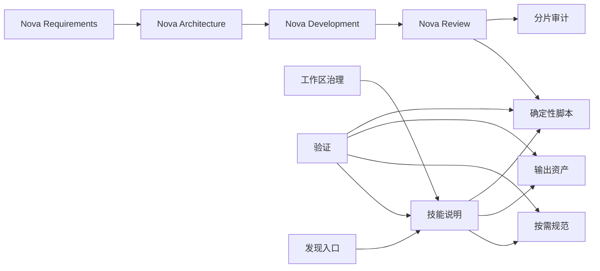

# AI Skills 工作区 — 项目蓝图

> 蓝图规范版本：3
> 文档定位：定义所有技能共同遵守的工作区事实、代码落位、模块契约、系统资源边界和未完成工作包。
> 事实来源：总体业务以 `.nova/PRODUCT_REQUIREMENTS.md` 与需求块为准，待开发目标以 `.nova/design/` 工作包为准；当前行为以技能源码、脚本和测试为准。
> 源码边界：`/home/nika/workspace/ai/skills` 是唯一可写源码，个人技能目录只保留发现链接。

## 1. 项目定位

| 对象 | 问题 | 成功结果 |
|------|------|----------|
| 技能使用者 | 需要可发现且不越权的专业工作流 | 调用技能得到符合声明契约的结果 |
| 技能维护者 | 开发目录和个人安装目录容易形成多个可写副本 | 工作区保留唯一源码，修改可验证、可审查、可恢复 |
| Codex 运行时 | 长说明和重复事实会污染上下文 | 入口保持紧凑，条件性规范按需加载，结果不泄漏内部推理 |

## 2. 技术栈

| 类别 | 当前事实或硬约束 | 事实来源 |
|------|------------------|----------|
| 技能说明 | Markdown 与 YAML frontmatter | 各技能 `SKILL.md` |
| UI 元数据 | YAML | 各技能 `agents/openai.yaml` |
| 规范、模板与示例 | Markdown | 各技能 `references/` 与 `assets/` |
| 确定性校验 | Python 3 标准库 | 各技能 `scripts/` |
| 审计记录 | JSONL 与严格 JSON-in-YAML | `.nova/audit/features/`、`.nova/audit/reviews/` 与 `.nova/audit/index/` |
| 发现入口 | 本地文件系统符号链接 | 个人技能目录链接状态 |
| 版本控制 | 本地 Git `main` 分支，无远程 | `.git/` 与仓库配置 |

## 3. 代码结构

### 顶层目录

```text
.nova/
├── PRODUCT_REQUIREMENTS.md          总体业务、需求索引与状态契约（按需）
├── PROJECT_BLUEPRINT.md             工作区公共技术契约和待办索引
├── requirements/                    可独立交付的长期需求块（按需）
├── architecture/                    并行开发前置共享契约（按需）
├── design/                          已确认或已实现的功能设计
└── audit/                           分片 Review 与完成审计
codex/AGENTS.global.md               全局 Codex 最小启动与安全内核
skill-name/
├── SKILL.md                         技能入口和资源路由
├── agents/openai.yaml               可选 UI 元数据
├── references/                      按需规范与完整示例
├── assets/                          生成结果使用的模板和静态资源
└── scripts/                         确定性工具及其测试
```

### 代码落位规则

| 代码区域 | 职责 | 代码落位规则 |
|----------|------|--------------|
| `.nova/` | 项目治理文档 | 总体需求、技术蓝图、按需架构契约、功能设计和审计统一落位；不创建空占位目录 |
| `.nova/requirements/` | 长期需求块 | 一个文件保存一个可由全栈工程师独立交付的完整业务定义 |
| `.nova/architecture/` | 并行开发前置 | 只保存共享 API、数据、事件与 Mock 契约，不保存实现代码或 ADR |
| `.nova/design/` | 工作区功能设计 | 一个史诗可含多个相关工作包，已完成设计继续保留 |
| `.nova/audit/` | Review 与完成功能审计 | 年度功能 JSONL、月度严格 JSON-in-YAML、工作项哈希索引，不建立无限增长总账 |
| `codex/` | Codex 全局治理权威文件 | 使用非 `AGENTS.md` 文件名避免项目范围重复加载 |
| `skill-name/SKILL.md` | 触发、核心规则和资源路由 | 保留每次执行都需要的内容，目标少于 500 行 |
| `skill-name/references/` | 条件性流程、格式规范和完整示例 | 由 `SKILL.md` 说明读取条件，规则只保留一份 |
| `skill-name/assets/` | 复制或改写为输出的模板 | 不作为隐藏指令或运行状态存储 |
| `skill-name/scripts/` | 可重复的确定性操作 | 同目录放直接测试，失败返回非零状态 |

## 4. 模块架构

### 依赖图



### 模块职责

| 模块 | 职责 | 对外边界 |
|------|------|----------|
| 工作区治理 | 定义所有技能共同遵守的事实和开发边界 | 根蓝图、Git 基线 |
| 技能说明 | 定义触发、核心工作流和条件性资源路由 | `SKILL.md` |
| 按需规范 | 保存只在特定阶段读取的详细契约和示例 | `references/` 中被路由的文件 |
| 输出资产 | 提供生成结果使用的骨架或静态资源 | `assets/` 中被明确选择的文件 |
| 确定性脚本 | 执行反复且需要稳定结论的检查或转换 | 命令行输入、退出状态和诊断输出 |
| 验证 | 检查结构、引用、脚本和关键行为 | 官方校验、项目测试和独立 Review |
| 发现入口 | 让运行时加载工作区唯一技能源码 | 个人目录符号链接和 UI 元数据 |
| Review 治理 | 人工选择待审项、独立审查和 PASS 后关闭 | `nova-review` 入口、SOP 与确定性脚本 |
| 分片审计 | 保存工作项、commit、验证与 Review 批次的可追踪关系 | 年度 JSONL、月度 JSON-in-YAML 和工作项哈希索引 |
| 需求治理 | 收敛总体业务与可独立交付需求块，维护稳定 REQ 身份、版本和状态 | `nova-requirements` 与 `.nova/PRODUCT_REQUIREMENTS.md` |
| 架构治理 | 冻结足以指导开发和并行协作的技术栈、API、数据、事件和 Mock 契约 | `nova-architecture`、蓝图与 `.nova/architecture/` |
| 开发交付 | 将目标需求或普通功能收敛为自包含设计并完成实现、测试和本地提交 | `nova-development`、PEND/FIX/MAINT 与 `.nova/design/` |

## 5. 跨模块契约

### 全局契约

| 契约 | 适用范围 | 验证 |
|------|----------|------|
| C-01 | 技能目录名、frontmatter 名称和 UI 默认提示中的技能名一致 | 官方技能校验和元数据检查 |
| C-02 | 每个可发现技能只解析到一份工作区实体源码 | 工作区路径与个人链接解析比较 |
| C-03 | `SKILL.md` 只保留核心规则和路由，条件性长规范按需加载 | 行数、引用和重复规则检查 |
| C-04 | 蓝图保存全局约束，设计保存待开发目标，代码/测试/配置证明当前实现 | 文档分流和引用检查 |
| C-05 | 用户可见结果不包含推理草稿、代理状态、工具过程、凭据或生产数据 | 前向场景与内容扫描 |
| C-06 | 校验器只读、结果确定，失败返回非零且不得以警告伪装成功 | 正反用例连续运行 |
| C-07 | 全局治理代表用户持续授权最低验收通过且无阻断后的精确范围本地 Git commit，当次可明确撤回；push、远程配置和 SVN commit 必须独立授权 | trailers、`git status`、提交历史和远程状态 |
| C-08 | 工作包最低验收后进入待 Review 并保留蓝图条目；有效 Review PASS 后才删除待办，设计文档及稳定锚点继续保留 | 蓝图、Review 审计与设计生命周期校验 |
| C-09 | 外部参考事实、AI 候选决定和用户正式确认必须分离；用户委托 AI 决策可以免除逐项提问，但不能免除必要研究、具体决定披露、可修正状态和整份摘要确认 | 三阶段路由、参考研究与候选修正前向测试 |
| C-10 | 项目上下文按新会话、目标路径和稳定文件快照渐进读取；版本 3 正常澄清不加载迁移流程，显式审计除外；无文档写入不运行文档校验 | 资源路由测试与前向场景 |
| C-11 | 设计文件以创建日期命名；已实现或已废弃设计不承载后续需求，原功能演进必须新建设计并链接历史来源 | 文件名、演进链接和终态隔离测试 |
| C-12 | 默认开发不自动 Review；用户可显式选择当前会话项、多个编号或全部未审项，并可中断返回调试 | Review 选择与中断前向测试 |
| C-13 | 工作项身份与 commit 证据分离；可信审计归档是编号不可逆终态，完成和 Review 按年度 JSONL、月度严格 JSON-in-YAML 与工作项哈希索引分片记录，非法、伪造、归档复用、跨年重复或并发关闭失败封闭 | trailers、生命周期门禁、审计一致性、定向查询、竞态与幂等关闭测试 |
| C-14 | 新工作项使用分类前缀加小写规范 UUIDv7 无状态生成；既有数字编号保持合法且不改写；未归档原范围修正与 Review 修复沿用原 ID，归档后重新分类建项并对明确来源保留可校验关联 | UUID 版本/variant、兼容性、活动期复用、归档拒绝、来源关联和唯一性测试 |
| C-15 | 非 Plan mode 新建 `PEND-*` 时，已确认设计和蓝图校验通过后自动进入实施；只有用户限定仅规划、明确暂停或存在实施阻断时才停止，且不得因此自动启动 Review | 实施交接路由正反用例与 Plan mode 边界测试 |
| C-16 | 活动设计以唯一语义键保存原子契约，工作包按完整能力划分；多包设计由唯一收口包承担组合验收，实施交接前后以排除状态的语义指纹防止设计漂移 | 设计版本兼容、语义键、收口依赖、组合验收与指纹稳定性测试 |
| C-17 | AI 只能提出覆盖整份设计的候选收敛；用户明确确认后，新版设计以语义指纹记录收敛确认并自动进入实施，未确认、中断或指纹失配一律保持澄清状态 | 整份设计确认、草稿恢复、确认指纹和实施交接正反用例 |
| C-18 | 自动路由首轮只读取用户表达、需求索引和蓝图活动索引；普通功能/FIX 与 Review 不自动读取需求正文，无法判定时只问一个问题 | 路由前向测试与文件访问边界测试 |
| C-19 | `REQ-{uuidv7}` 是长期需求身份并以版本和 `待实现/已实现/已更新` 管理，`PEND-*` 是独立交付身份；版本 5 设计和活动蓝图必须保存逐字一致的 `REQ-...@vN`，实现依据必须可从可信审计验证 | 需求校验、跨文档引用不变量和 Review 状态回写测试 |
| C-20 | 绿地项目先需求后架构；共享工程骨架、数据所有权及所需 API/事件/Mock 契约只有能从不可变审计派生 Review PASS 时才启动并行业务开发，只有不可消除的业务硬依赖允许串行 | 架构 ready 门禁、契约内容、可信证据与并行场景测试 |
| C-21 | 项目治理文档统一位于 `.nova/`；旧布局迁移以覆盖实体类型、模式、内容树和改写字节的 `Plan-SHA256` 绑定用户批准，再用 `git mv` 与同目录临时文件原子应用；活动设计确定性刷新路径变化后的收敛指纹，符号链接不跟随，任一失败恢复字节、模式、Git 状态和目录，历史审计及终态设计正文保持原字节 | 计划失配、越界、冲突、完整版本 5 设计、部分写入、原子替换、后置校验、回滚、兼容解析与幂等测试 |

### 开发决策边界

| 边界 | 内容 |
|------|------|
| 本期必须实现 | 需求—架构—开发分层、`.nova` 统一布局、有限加载、并行契约门禁、默认快速提交和人工 Review/分片审计 |
| 明确不做 | 不建设技能市场、远程发布、遥测、账号系统或第二份个人目录实体源码 |
| 后续候选 | 仅限第 6 节尚未完成的工作包，澄清前不获得实施授权 |
| AI 可自行决定 | 不改变触发、外部行为、安全和数据语义的内部命名、排版及脚本组织 |
| 必须再次确认 | 删除或重命名技能、改变公开调用或阶段职责、改变需求状态或并行门禁、引入依赖/网络/凭据、配置远程仓库、改变发现链接策略或放宽校验 |

## 6. 待开发功能

| 编号 | 优先级 | 来源 | 功能 | 设计依据 | 前置依赖 | 完成定义 | 需求引用 |
|------|--------|------|------|----------|----------|----------|----------|
| PEND-01a05bb2-de06-772b-aa7a-8fd2aced7911 | P1 | 用户提出 | Nova 访谈委托决策与参考研究共享契约 | [共享契约架构](design/2026-09-01_Nova访谈委托决策与参考研究闭环.md#wp-01-interview-governance-architecture) | 无 | 蓝图、共享工程骨架和访谈决策状态契约完成并通过校验，公共 API、事件和 Mock 明确不适用 | 无 |
| PEND-002 | P2 | 历史迁移 | 工作区统一验证入口 | 待澄清 | 待澄清 | 一条本地命令可发现全部技能并分别执行结构与行为校验 | 无 |
| PEND-003 | P2 | 历史迁移 | 技能目录索引 | 待澄清 | 待澄清 | 自动生成技能名称、用途、入口和验证状态，不复制技能正文 | 无 |
| PEND-004 | P3 | 历史迁移 | 持续集成 | 待澄清 | 待澄清 | 在受控环境执行无网络的结构、语法和正反用例检查 | 无 |
| PEND-005 | P3 | 历史迁移 | 安装与回滚工具 | 待澄清 | 待澄清 | 安装入口切换可验证、可回滚，且不覆盖用户已有技能 | 无 |

## 7. 系统架构

### 分层与代码映射

| 层 | 职责 | 对应代码结构 | 允许依赖 |
|----|------|--------------|----------|
| 治理层 | 定义总体需求、公共架构契约和未完成工作 | `.nova/PRODUCT_REQUIREMENTS.md`、`.nova/PROJECT_BLUEPRINT.md`、`.nova/architecture/`、`.nova/design/` | 不依赖单个技能实现细节 |
| 指令层 | 选择工作模式并路由必要资源 | `skill-name/SKILL.md` | 治理层、当前任务所需参考与工具 |
| 资源层 | 提供条件性规范、完整示例和输出资产 | `skill-name/references/`、`skill-name/assets/` | 治理层，不反向决定技能触发 |
| 执行层 | 执行确定性校验或转换 | `skill-name/scripts/` | 指令契约和被验证输入 |
| 接口层 | 暴露 UI 元数据与发现入口 | `skill-name/agents/`、个人目录链接 | 指令层，不复制业务规则 |

### 数据与资源安全

| 适用范围 | 不变量 | 验证 |
|----------|--------|------|
| 工作区源码 | 唯一可写实体位于工作区，个人目录只含符号链接 | `readlink` 与实体数量检查 |
| Review 审计 | 工作项稳定编号不变，commit 和批次只追加为证据；索引、功能行和 Review item 严格一致；非法关闭不得越出仓库、覆盖并发内容或产生部分记录 | manifest 预检、严格解析、符号链接/竞态、幂等与失败零写入测试 |
| 文档更新 | 覆盖或迁移前重读当前文件，发现并发变化即停止 | 修改前后摘要和 Git diff |
| 测试资源 | 临时夹具隔离创建，缓存被忽略，验证后不得成为事实来源 | 临时目录与 `git status` |
| 外部研究 | 有超时、取消和证据不足状态，不保存凭据或生产数据 | 研究记录和敏感内容扫描 |
| Git 提交 | 只暂存当前子任务文件，不配置或推送远程 | staged diff、remote 和提交检查 |
| 需求状态 | Review 只按活动蓝图中的 `REQ-...@vN` 更新总体需求索引，不读取需求块正文；旧版本实现不得覆盖较新需求状态 | Review 状态回写正反用例 |

### 运行与恢复

| 资源或失败点 | 所有者 | 恢复与清理 |
|--------------|--------|------------|
| 技能结构修改 | 技能维护者 | 验证失败不提交；保留最近通过验证的 Git 基线 |
| 发现链接切换 | 技能维护者 | 目标异常时停止，不留下第二份实体源码 |
| 校验脚本 | 脚本进程 | 读失败或契约错误返回 1，不修改输入 |
| 临时前向测试 | 测试进程 | 使用隔离目录，结束后清理或由临时目录生命周期回收 |
| 人工 Review 拒绝或中断 | 主代理 | 按 `nova-review` 统一修复并复审，或保留未审状态返回调试；不自动关闭待办 |
| 旧布局迁移 | `nova-development` 迁移器 | 冲突或校验失败时零写入；成功后只保留 `.nova/` 实体，旧路径由确定性映射解析 |
