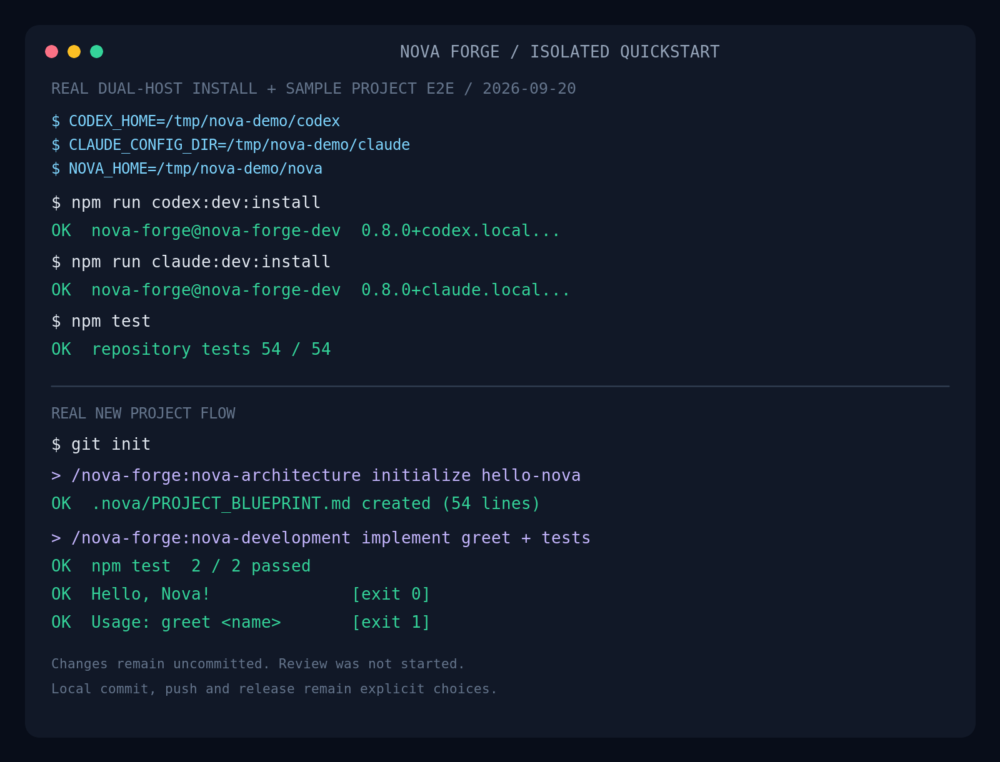
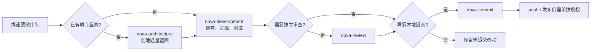

# Nova Forge

Nova Forge 是面向 Codex 与 Claude Code 的轻量级开发 SOP。它让 AI 先理解项目事实，再完成实现和测试；架构、需求、Review、提交、push 与发布仍由你按需明确发起。

它不是自动化开发框架，也不维护状态机、审计台账或“需求—代码—提交”的强制追溯链路。日常开发仍然可以直接说人话。



> 上图来自隔离的 `CODEX_HOME` / `CLAUDE_CONFIG_DIR` / `NOVA_HOME` 与临时 Git 项目实测：双宿主开发插件安装成功，仓库测试 54/54 通过，并真实完成“创建蓝图 → 开发 greet 命令 → 示例测试 2/2 通过”。

## 30 秒理解



默认主路径只有：**Development 理解与调查 → 必要时问一个关键问题 → 实现 → 测试 → 按需继续修改**。

- 不会因为开始开发就自动写需求、创建设计、启动 Review 或提交。
- 不会自动 push、发布或执行 SVN commit。
- 只有真正会改变交付结果且无法从项目中查明的歧义，才会中断并提问。
- 工作树里已有的修改属于你，Nova Forge 会先固定基线，不覆盖、不回退、不夹带。

## 五个技能怎么选

通常直接描述任务即可；当你想明确控制阶段时，再点名技能。

| 技能 | 什么时候用 | 会做什么 | 不会做什么 |
|---|---|---|---|
| `nova-requirements` | 你明确要澄清、创建、查看、修改或删除整体业务需求 | 维护轻量业务需求文档 | 不实现、不改架构、不维护开发状态 |
| `nova-architecture` | 新项目没有蓝图，或你明确要改变技术栈、运行形态、分层、稳定目录、模块职责或依赖方向 | 创建或更新 `.nova/PROJECT_BLUEPRINT.md`，必要时维护共享架构契约 | 不实现业务代码、不 Review、不提交 |
| `nova-development` | 任何具体功能、调整、修复、配置、测试或文档维护 | 先查项目事实，再实现并做风险相称的测试 | 不自动 Review、提交、push 或发布 |
| `nova-review` | 你明确要求 Review、审查、复审或补审 | 独立只读审查；发现问题时统一修复、复测和复审 | 不提交、不 push |
| `nova-commit` | 你明确要求创建本地 Git 提交 | 只消费已有且有效的验证证据，精确暂存并创建 Conventional Commit | 不修改代码、不补跑测试、不 amend、不 push |

## 安装

### Codex

```bash
codex plugin marketplace add Kabulaka/nova-forge --ref v0.8.2
codex plugin add nova-forge@nova-forge
```

安装或升级后请新开一个 Codex 会话，让新版本的技能与全局规则生效。

### Claude Code

在 Claude Code 中执行：

```text
/plugin marketplace add Kabulaka/nova-forge
/plugin install nova-forge@nova-forge
```

插件只在 `SessionStart` 的 `startup`、`resume`、`clear` 和 `compact` 事件注入核心规则。没有 MCP 服务、后台状态或其他生命周期 Hook。

## 新开一个项目怎么做

下面以一个 Node.js CLI 为例；Java、Go、Rust、前端或已有代码库的用法相同。

### 1. 创建项目并打开新的 AI 会话

```bash
mkdir hello-nova
cd hello-nova
git init
```

推荐先初始化 Git。Nova Forge 会以当前工作树为基线保护已有修改，但不会替你提交。

### 2. 让 Architecture 创建轻量蓝图

Codex 中可以直接输入：

```text
使用 $nova-forge:nova-architecture 初始化这个项目。
它是一个 Node.js CLI，名称为 hello-nova，先只建立轻量项目蓝图，不实现功能。
```

Claude Code 中可以输入同样的自然语言，或显式调用 `/nova-forge:nova-architecture`。

Architecture 会先展示轻量架构摘要和目标文件，等你确认后再写入；这个确认只针对系统骨架，不会变成每次开发都要走的审批流程。

产物是 `.nova/PROJECT_BLUEPRINT.md`。它是后续开发一次读取的轻量入口，保存系统骨架、已经交付的通用能力和大块待开发工作；它不是任务台账。

### 3. 直接描述第一个开发任务

```text
使用 $nova-forge:nova-development 开发 greet 命令：
- 输入姓名，输出 Hello, <name>!
- 姓名为空时返回非零退出码并显示用法
- 补齐测试并实际运行
```

请求已经明确时，Development 会直接调查、实现和测试，不会先让你填写一套表单。完成后改动仍是未提交状态，你可以继续修改或自己检查差异。

### 4. Review 与提交按需发起

需要独立审查时：

```text
使用 $nova-forge:nova-review 审查这次 greet 命令的当前任务差异。
```

确认实现和验证都满意后，再创建本地提交：

```text
使用 $nova-forge:nova-commit 创建一个本地提交。
```

`nova-commit` 不会为了凑齐准入条件临时跑测试或修改代码。验证证据缺失或已经失效时，它会拒绝提交，并告诉你需要先补哪项 Development 验证。

## 日常开发怎么说

你不需要每次都背技能名。下面这些自然语言请求会进入对应流程：

```text
给订单列表增加按客户名称筛选，保持现有分页语义，补接口和前端测试。

修复上传空文件时一直转圈的问题。先复现并说明原因，确认缺陷存在后给我修复方案，等我确认再改。

把 API 超时改为可配置，默认值保持不变，并验证旧配置兼容。
```

如果你更看重可控性，可以显式写出技能：

```text
使用 $nova-forge:nova-development 实现……
使用 $nova-forge:nova-review 审查当前任务差异……
使用 $nova-forge:nova-commit 创建本地提交……
```

一个高效请求通常只需要四类信息：

```text
目标：要得到什么用户可见结果
范围：相关模块、路径或明确排除项
约束：兼容性、安全、数据或失败语义
验收：要运行什么测试，或什么现象算完成
```

不确定的信息可以直接说“不确定，请先从代码和运行状态判断”。Nova Forge 会先研究能查明的事实，不把检索工作推回给你。

## 提高效率的小技巧

1. **把结果说清楚，不必写实现方案。** 说明用户行为、边界和验收，比指定内部类名更有用；已有实现细节让 Development 从代码中查。
2. **一次交付一个内聚目标。** API、前端和测试共同构成同一功能时可以一起做；彼此无关的功能分开请求，基线和验收会更清楚。
3. **给出精确入口。** 已知文件、错误日志、接口、页面或复现输入时直接附上，可显著减少探索时间。
4. **有真实运行要求就明确写。** 例如“用这个 DOCX 实际跑一遍”“在浏览器中点击验收”“不要只跑单元测试”。
5. **不要用“继续”代替新的授权。** “继续修改”只延续当前开发，不代表允许 Review、Commit、push 或发布。
6. **设计只在值得沉淀时创建。** 普通开发不需要先写设计文档；只有你明确要求设计、规划或拆分时才会持久化。
7. **Review 和 Commit 分开说。** 需要代码审查就明确要求 Review；只想本地提交就明确要求 Commit。二者都不会自动触发远程操作。
8. **保留真实验收证据。** 测试命令、工作目录、输入和环境没变时可复用证据，不必重复跑全量测试。

## 已有项目怎么接入

1. 安装插件后，在项目根目录新开会话。
2. 如果没有 `.nova/PROJECT_BLUEPRINT.md`，先让 `nova-architecture` 根据现有代码创建轻量蓝图。
3. 如果蓝图已经存在，直接描述开发任务；Development 会读取蓝图中与本次任务命中的入口，不会扫描需求库或设计目录。
4. 工作树不干净也可以开始，但相关文件中的旧改动必须能与本任务可靠分离；无法分离时 Nova Forge 会停下来问你如何处理。

## 本地开发与隔离测试

开发 Nova Forge 自身时：

```bash
npm run codex:dev:install
npm run claude:dev:install
```

隔离安装示例：

```bash
demo_root="$(mktemp -d)"
mkdir -p "$demo_root/codex" "$demo_root/claude" "$demo_root/nova"

CODEX_HOME="$demo_root/codex" \
NOVA_HOME="$demo_root/nova" \
npm run codex:dev:install

CLAUDE_CONFIG_DIR="$demo_root/claude" \
NOVA_HOME="$demo_root/nova" \
npm run claude:dev:install
```

`CODEX_HOME`、`CLAUDE_CONFIG_DIR` 和 `NOVA_HOME` 必须使用绝对路径。这里的 `NOVA_HOME` 只保存开发版 marketplace 快照，不保存会话或项目状态。隔离目录不会继承登录凭据；若要在其中真正发起模型会话，需要按宿主正常登录。

卸载本地开发版：

```bash
npm run codex:dev:uninstall
npm run claude:dev:uninstall
```

仓库验证：

```bash
npm run check
```

它会依次校验版本、双宿主插件结构、Release Notes、GitHub Actions 工作流、自动化测试和 npm 包内容。

## 常见问题

### 安装后看不到技能

先新开会话。插件规则和技能在会话启动时加载，已经打开的旧会话不会自动切换到新快照。

### 每次开发都要点名 `nova-development` 吗

不用。插件会按请求语义路由；显式点名适合你希望固定当前阶段，或需要复制一条可复现指令时。

### 新项目一定要先写完整需求吗

不用。蓝图缺失时只初始化轻量系统骨架；业务需求只有在你明确要求时才由 `nova-requirements` 维护。明确的第一个功能可以随后直接开发。

### Development 会不会改项目架构

业务 API、DTO、数据库表、业务事件和端到端流程通常属于 Development。只有确实要改变技术栈、运行形态、基础设施职责、系统分层、稳定目录、项目级模块职责或依赖方向时，才需要你明确发起 Architecture。

### 完成后为什么没有提交或 push

这是刻意的安全边界。Development、Architecture 与 Review 都保持未提交；`nova-commit` 只创建本地提交。push、发布和 SVN commit 必须另行明确授权。
