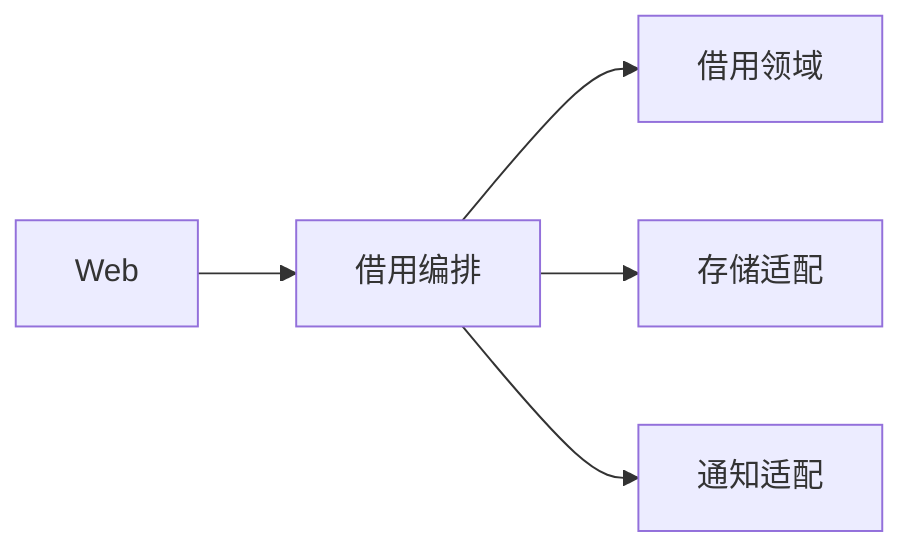

# 内部设备借用平台 — 项目蓝图

> 蓝图规范版本：3
> 文档定位：定义设备借用平台共同遵守的项目级规则和未完成工作包。
> 事实来源：待开发行为以 `.nova/design/` 为准；当前实现以代码、测试、迁移和配置为准。

## 1. 项目定位

| 对象 | 问题 | 成功结果 |
|------|------|----------|
| 公司员工和资产管理员 | 设备借用依赖线下登记，库存冲突和责任状态不可追踪 | 员工可申请可用设备，管理员可审批和确认归还，任一设备同时只有一个有效占用 |

## 2. 技术栈

| 类别 | 当前事实或硬约束 | 事实来源 |
|------|------------------|----------|
| Web | 服务端 HTTP API 与浏览器页面 | 已确认部署边界 |
| 数据库 | 支持事务和唯一约束的关系数据库 | 设备占用不变量 |
| 校验 | 项目自带自动化测试 | 完成定义 |

## 3. 代码结构

### 顶层目录

```text
src/web/                 HTTP 控制层
src/application/         用例编排层
src/domain/              设备借用领域规则
src/infrastructure/      数据库和通知适配
tests/                   契约与行为验证
```

### 代码落位规则

| 代码区域 | 职责 | 代码落位规则 |
|----------|------|--------------|
| `src/web/` | 协议解析和响应映射 | 不写审批、库存或状态规则 |
| `src/application/` | 用例事务和跨模块编排 | 只通过领域接口改变借用状态 |
| `src/domain/` | 借用模型和不变量 | 不依赖 Web 或数据库实现 |
| `src/infrastructure/` | 持久化和外部通知 | 实现领域定义的端口 |
| `tests/` | 验证公开契约和失败恢复 | 测试不得放宽业务断言迁就实现 |

## 4. 模块架构

### 依赖图



### 模块职责

| 模块 | 职责 | 对外边界 |
|------|------|----------|
| Web | 接收申请、审批和归还请求 | HTTP 请求与响应 |
| 借用编排 | 控制事务和通知顺序 | 借用用例接口 |
| 借用领域 | 判定库存、权限和状态转换 | 领域命令与结果 |
| 存储适配 | 原子保存设备与借用记录 | 仓储接口 |
| 通知适配 | 发送审批结果通知 | 可重试通知接口 |

## 5. 跨模块契约

### 全局契约

| 契约 | 适用范围 | 验证 |
|------|----------|------|
| C-01 | Web、编排、领域和存储使用同一借用状态定义 | 状态转换契约测试 |
| C-02 | 任一设备同时最多存在一个有效借用 | 数据库唯一约束和并发测试 |
| C-03 | 通知失败不得回滚已经提交的业务状态 | 通知失败测试检查持久化结果 |

### 开发决策边界

| 边界 | 内容 |
|------|------|
| 本期必须实现 | 申请、审批、驳回、领用和归还闭环 |
| 明确不做 | 不采购设备，不计算折旧，不对接门禁 |
| 后续候选 | 逾期提醒和设备维修流程 |
| AI 可自行决定 | 不改变契约的内部命名、日志字段和页面布局 |
| 必须再次确认 | 新增审批层级、自动审批或外部消息渠道 |

## 6. 待开发功能

| 编号 | 优先级 | 来源 | 功能 | 设计依据 | 前置依赖 | 完成定义 | 需求引用 |
|------|--------|------|------|----------|----------|----------|----------|
| BORROW-001 | P1 | 用户提出 | 提交设备借用申请 | [借用申请 WP-01](design/2026-08-25_设备借用闭环.md#wp-01-request) | 无 | 员工可提交有效申请，库存冲突和非法输入被拒绝且不占用设备 | 无 |
| BORROW-002 | P1 | 用户提出 | 审批、领用与归还 | [审批归还 WP-02](design/2026-08-25_设备借用闭环.md#wp-02-approval) | BORROW-001 | 管理员可审批或驳回，批准设备可领用并归还，失败不会产生重复占用 | 无 |
| BORROW-003 | P1 | 用户提出 | 借用闭环收口 | [借用闭环 WP-03](design/2026-08-25_设备借用闭环.md#wp-03-closure) | BORROW-001、BORROW-002 | 申请、审批、领用和归还组合后保持状态、权限和设备占用一致 | 无 |

## 7. 系统架构

### 分层与代码映射

| 层 | 职责 | 对应代码结构 | 允许依赖 |
|----|------|--------------|----------|
| 控制层 | 协议、认证上下文和错误映射 | `src/web/` | 应用层 |
| 应用层 | 用例事务和副作用编排 | `src/application/` | 领域层、基础设施端口 |
| 领域层 | 状态、权限和设备占用不变量 | `src/domain/` | 无外层依赖 |
| 基础设施层 | 数据库与通知实现 | `src/infrastructure/` | 领域端口、外部资源 |

### 数据与资源安全

| 适用范围 | 不变量 | 验证 |
|----------|--------|------|
| 借用写入 | 设备占用和借用状态在同一事务提交 | 故障注入检查无半成品状态 |
| 并发审批 | 同一申请和设备的冲突写入只能成功一次 | 并发集成测试和唯一约束 |
| 通知资源 | 通知调用有超时，不持有数据库事务等待外部响应 | 超时测试与事务边界检查 |

### 运行与恢复

| 资源或失败点 | 所有者 | 恢复与清理 |
|--------------|--------|------------|
| 数据库事务 | 应用层 | 任一步骤失败均回滚设备和借用写入 |
| 通知失败 | 通知适配 | 保留已提交业务状态并记录可重试失败 |
| 客户端重复请求 | Web 与应用层 | 使用请求标识返回同一结果，不重复占用 |
