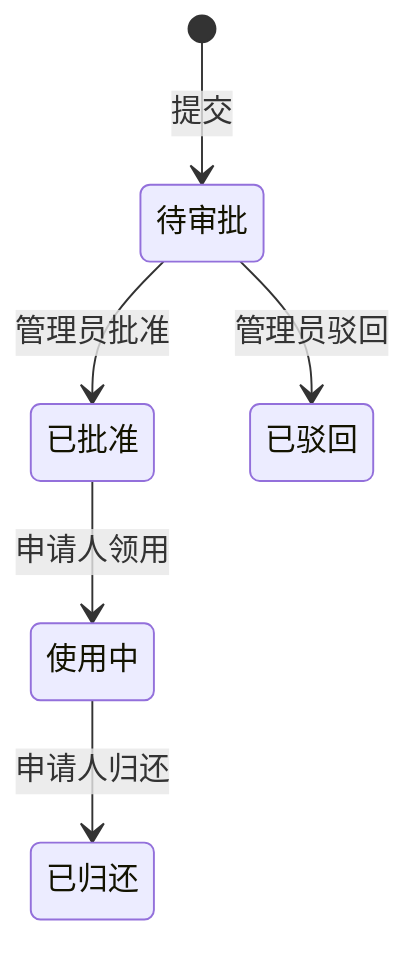

# 设备借用闭环设计

> 设计规范版本：3
> 设计状态：已确认
> 工作包：WP-01、WP-02

## 1. 共享约束

### 1.1 问题与成功结果

| 问题 | 成功结果 |
|------|----------|
| 申请、审批和设备占用分散登记，无法可靠避免冲突 | 一个申请沿同一状态链完成审批、领用和归还，设备有效占用始终唯一 |

### 1.2 共享契约

| 契约 | 已确认约束 |
|------|------------|
| S-01 | 借用状态只允许 `待审批 → 已批准 → 使用中 → 已归还`，或从待审批进入 `已驳回` |
| S-02 | 员工只能操作自己的申请；资产管理员审批，申请人确认领用和归还 |
| S-03 | 蓝图 C-02 中的“有效借用”在本史诗指处于已批准或使用中的借用 |

### 1.3 状态图

## 2. 工作包地图

| 工作包 | 状态 | 交付结果 | 前置依赖 | 设计章节 |
|--------|------|----------|----------|----------|
| WP-01 | 已确认 | 员工提交可验证且不重复占用的借用申请 | 无 | [借用申请](#wp-01-request) |
| WP-02 | 已确认 | 管理员审批后由员工完成领用和归还 | WP-01 | [审批归还](#wp-02-approval) |

## WP-01 借用申请

### 契约

| 契约 | 维度 | 已确认约束 |
|------|------|------------|
| WP-01-C01 | 交付边界 | 创建待审批申请并校验设备可申请；不实现审批或通知 |
| WP-01-C02 | 参与者与权限 | 已登录员工只能以本人身份提交和查看申请 |
| WP-01-C03 | 触发与输入 | 输入设备、开始时间、预计归还时间和用途；结束时间必须晚于开始时间 |
| WP-01-C04 | 结果、状态与不变量 | 成功产生唯一待审批申请；提交阶段不产生有效设备占用 |
| WP-01-C05 | 失败与恢复 | 非法时间、设备不存在或重复请求返回明确错误，不保存半成品申请 |
| WP-01-C06 | AI 决策边界 | 可决定表单布局和内部校验函数；新增申请字段或代他人申请必须再次确认 |

### 验收

| 覆盖契约 | 场景 | 预期结果 |
|----------|------|----------|
| WP-01-C01、WP-01-C02、WP-01-C03、WP-01-C04 | 员工提交合法申请 | 生成本人唯一待审批申请，设备仍未被占用 |
| WP-01-C03、WP-01-C05 | 归还时间早于开始时间 | 返回输入错误且没有申请记录 |
| WP-01-C05 | 相同请求标识重复提交 | 返回同一申请，不新增第二条记录 |
| WP-01-C06 | 请求增加代申请人字段 | 实现前要求再次确认 |

## WP-02 审批、领用与归还

### 契约

| 契约 | 维度 | 已确认约束 |
|------|------|------------|
| WP-02-C01 | 交付边界 | 支持批准、驳回、领用和归还；不实现多级审批和逾期提醒 |
| WP-02-C02 | 参与者与权限 | 资产管理员批准或驳回；申请人领用和归还；其他人无权改变状态 |
| WP-02-C03 | 触发与输入 | 审批输入申请版本和决定，驳回需原因；领用和归还输入当前版本 |
| WP-02-C04 | 结果、状态与不变量 | 状态按 S-01 转换；批准时原子建立满足 S-03 的设备占用，归还时释放 |
| WP-02-C05 | 失败与恢复 | 版本冲突或设备已占用时不改变申请；通知失败遵守蓝图 C-03，并记录可重试状态 |
| WP-02-C06 | AI 决策边界 | 可决定通知重试的内部实现；新增自动审批、审批层级或消息渠道必须再次确认 |

### 验收

| 覆盖契约 | 场景 | 预期结果 |
|----------|------|----------|
| S-01、S-02、WP-02-C01、WP-02-C02、WP-02-C03、WP-02-C04 | 管理员批准后申请人领用并归还 | 状态依次变化，批准时占用、归还时释放 |
| S-03、WP-02-C04、WP-02-C05 | 两个申请并发批准同一设备 | 只有一个批准成功，失败申请和设备状态一致 |
| WP-02-C02、WP-02-C05 | 普通员工尝试审批 | 返回权限错误且状态不变 |
| WP-02-C05 | 批准提交后通知超时 | 批准和占用保留，通知失败可重试且事务已释放 |
| WP-02-C06 | 请求增加第二级审批 | 实现前要求再次确认 |
